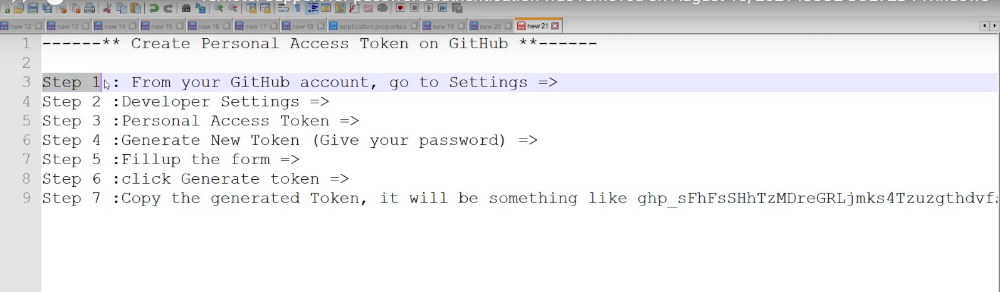

# Git and Github command line

[Go to markDown Guide](https://www.markdownguide.org/basic-syntax/)
[Go to markDown HUB Guide](https://www.jetbrains.com/help/hub/Markdown-Syntax.html#quick-notes-markdown-paragraphs)

> **λ git --version**
>
> **λ  git config --global user.name "imoo"**
>
> ## to check  the Globel name
>
> **git config --global user.name**.

## to check  the Globel email
>
> **git config --global user email**

## to check  the Globel Config--list
>
> **λ  git config  --list**

### Directory command
>
>-----------------
>
>## Directory
>
> **λ  show dir : `dir || ls`**
>
> **λ  current dir : `pwd (Print window directory)`**
>
> **λ  Create folder :`md *folderName*`**
>
> **λ  Create nested folder :`md folderName*/*folderName*/*folderName*`**
>
> **λ  Rename folder :`ren||mv (old folder new name folder)`**
>
> **λ  Create file : `typenull>||touch name file`.extention**
>
> **λ  Delete file : `del nameFile.extension` ~~Deleted~~**
>
> **λ  Delete folder : rd *folderName***
>
> **λ  Clear cmd : `cls`**
>
> **λ  Open file : `start namefile.extension`**
>
> **λ  edit file : `nano namefile.extension`**
>
> **λ  Create file : `typenull> name file.extention`**
> **λ   : `cd => open dir`**
> **λ   : `cd.. => back dir`**
> **λ   : `cd- => back main dir`**
> **λ   : `cd => Root`**
------------------------------------------*
>
>##  Repository
>
> **λ  Create repo : `git init`**
> **λ  cheack status : `git status`**
> **λ  add file to repo : `git add (name of file)`**
> **λ  add all file to repo : `git add. (name of file)`**
> **λ  commit file to repo : `git commit-m "message" (DEl||UPD||FIX||ADD + name of file)`**
>
>
> **λ where the last commit  and where is the head pointer  stay : `λ git log --oneline ||λ git log --oneline --graph --all –decorate`**
>
> **λ Compare between  file before you edit and  after you edit : `λ git diff`**
>
> **λ where the last commit  and where is the head pointer  stay : `λ git log --oneline`**
>
>
>
>## ~~Deleting~~*
>
> **λ  Delete file from working directory : `rm||del nameFile` ~~Deleted~~**
> **λ  Delete file from repository : `git rm nameFile` ~~Deleted~~**
> **λ  Delete file from stage : `git rm -f nameFile` ~~Deleted~~**
>
>## Rename*
>
> **λ  rename file from working directory : `mv||ren nameFile`**
> **λ  rename file from stage && repository : `git mv -f nameFile`**


>
>## undo Edit the  file  from  the  working
>
>**git checkout + Nameof file**
<!-- //////////////////////// -->
>## undo Edit the  file  from  the stage*
>
>**git reset HEAD + Nameof file**

<!-- %%%%%%%%%%%%%%%%%%%%%%%%%%%% -->

>### Edit the  Last commit without make new commit *
>
>**git commit --amend -m “this fixes the previous oopsies”**
--
--    فاالي حصل هو عمليه دمج بين القديم والجديد وقدرت بكل بساطه اعدل في الملف بدون ماعمل
new commit
--
Example to remmber
 ~/OneDrive/Desktop/project (master)
$  git status
Changes not staged for commit:
  (use "git add <file..." to update what will be committed)
  (use "git restore file..." to discard changes in working directory)
        modified:   note3.txt
>
>
> ~/OneDrive/Desktop/project (master)
$  git commit --amend -m "new update in same commit"
<!-- -- -->
``` Html
<h2>Example of code</h2>
```

<div \` dir="auto">
  ازاي  نرجع ال  code  القديم باستخدام ال  git
  عشان ترجع لازم تاخد اول  7  ارقام
  SHA in git log
git cheackout  and copy  7 num of SHA + name of file
  انا رجعتوا منا  stage area  الي working directory
  <!-- -----------------------------------------
   -->
 --*****************************************
 ازي اغير ال sha  باستخدام ال  soft
 sHa  هي عباره عن اول 7 ارقاممن أي  commit  انتا حابب ترجع ليه
  هو من الاخر ان انا ممكن يكون عندي  commit  كثير ملهمش معني   هروح علي اخر  commit  ليه معني   واحذف الباقي وبتعمل بقي انتا  commit جديد ليه    اسم واضح
   اولا  git status and git log
 وخد اول  7  احرف من  sha
 من ال  commit  الي عايز اقف عندوا
> git reset --soft +sha

متنساش لو عايز تنزل ال ملف من stage area   الي working dirtory
  هنعمل
> git reset head + name of file

 ازاي نغير ال sha  باستخدام ال  mixed

> git reset --mixid +sha

 ازاي نغير ال sha  باستخدام ال  Hard

 Hard دي طريقه خطيره لان انتا  لو عملتها غلط هتحذف
ال git  الcode   الي انتا تعبت فيه
 هي بتحذف ال commit  بالcode  بتاعوا   فيفضل انك ما تستخدم هذه الطريقه كثير
> git reset --hard +sha

 هو بيحذف كل التعديلات الي هو عملها
 خلي بالك ال hard  لا تستخدمها كثير ولو استخدمتها لازم تكون مركز عشان مفيش حاجه هترجع

طريقة اخفاء الملفات من علي ال  git
>Touch.Gitignore

Dot  يعني هذا الملف مخفي   ولو ظهرت هتكون   مخفيه
Task  ده ليك مش لازم تخزنا جوه ال  git
 لو انتا عندك ملفات وانتا مش عايز تشاركها   زي ال  node module  
 بساطه انتا  بتفتح ملف  gitignore
  بعد كده انتا  بتحط اي شي انتا عايزوا فيه
  text.txt or *.exe دي يعني جميع الملفات الي امتددها exe

\*  لو عملت ملف exe معين ومش عايز اخفيه
هعمل ! علامه دي يعني معادا
! + imp.exe

\*   لو انا عندي ملف ايه  وعايز اخفيه
 أولا  هنشا الملف  باستخدام كود ال  dir
 Open file  gitignore
هتحط اسم الdir  وكمان معاه / مثلا node/
 طبعا انتا دخلت جوه node
  فلما تعمل  git status
 هيظر كده  node/
 وهو ده الموضوع
../ انك لازم تطلع من ملف ال node
 ترجع وراء

\*ايه الفرق بين  git add.  و بين  git add*
  الفرق هو add. بترفع الملفات المخفيه  وغير المخفية
 اما  add* مش بترفع الي ال غير مخفيه

</div>

>## Branch
>
> **λ  show all branch : `git branch`**
> **λ  Create branch : `git branch  Name of branch`**
> **λ  Switch branch : `git checkout  Name of branch`**
> **λ  Create &&Switch branch : `git checkout -b  Name of branch`**
> **λ  show difference between branches : `git diff master ..name other branch`**

Diff between current branch and master:

$ git diff master
Diff between two branches, e.g. master and staging:

$ git diff master..staging
Show only files that are different between the two branches (without changes themselves):

$ git diff --name-status master..staging

> **λ  rename branch : `git branch -m  old\new Name of branch`**
> **λ  delete branch : `git branch -d  Name of branch`**
> **λ  delete branch not merge  : `git branch -D  Name of branch`**

<div \` dir="auto"> لما بتنشي أي branch  بياخد الكود من master

 انا  دلوقتي ايزي اعمل  mirge
 لما عملت  branch جديد  وعملت فيه التعديلات المناسبه
  عايز ادمج ال  location مع ال  master  
عن طريق اضافة اخر  commint  ليك في  branch لاخر  commit موجود في  master
  المهم وانتا بتعمل  merge تكون واقف   عند master
</div>

 if we have 2 file master and branch is location ineed to merge  location to master
 so i switch to master then i write
> git merge location >>>this is one of easiest type of merge called **FastForword**

<div \` dir="rtl">
 النوع التاني اسموا  true merge
نفس الكلام انا انشات  branch  وحطيت عليه تعديلات وانا رايح ادمجوا مع ال master
  افتكرت اني عندي شويه تعديلات او  task عايز اعملوا في master
  هنا لو جيت عملت merge  هيحصل  conflict
  هتلاقي رساله ال  conflict  ان عندك تعديل ولازم ترفعوا دي المشكله الحل بكل بساطه ان تعكل  commiteجديد بعد كده تعمل  merge

</div>

### GitHub

<div \` dir="rtl">
  ازاي ارفع مشروع علي ال  github
   اولا انا لازم اعمل   create new repo in git hub
  الامر الاخر هو

> git init => to create  new  git repo
> git remote add origin + link of repo
> git remote to check if you remoting origin GitHUB or not
> git push -u origin master

 انتا ممكن تعمل  branch  عادي  وترفعوا مش شرط  ابدا
 يكون master
  فبتعمل  branch جديد خالص
>git branch -M main
> git remote add origin + link of repo
> git remote to chech if you remoting origin GitHUB or not
> git push -u origin main

  اي  تعدبل بترفع الاول علي ال  local server repo
then you add
> git push

 عشان ترفعوا remote to origin
 Orgin مسئوله علي ربط بين المشروع الي علي جهازك وال ال علي  email git hub
 >Git fetch Origin بتجيب كل branch الي موجود علي ال  github

 fork انا ممكن اخد كود أي نسخه واعدل عليه بعد كده اطلب منهم  merge
  Tags  بتساعد للوصول الي المشروع بسرعه
</div>
```
 git clone + url of project
```
#### how to solve this problem

 this problem we will face it every time we try to push  new project
remote: Support for password authentication was removed on August 13, 2021.
remote: Please see <https://docs.github.com/en/get-started/getting-started-with-git/about-remote-repositories#cloning-with-https-urls> for information on currently recommended modes of authentication.
fatal: Authentication failed for '<https://github.com/imooclam/-test.git/>



we should creat token [to solve this problem here](https://www.youtube.com/watch?v=65QlTSSlwhQ&t=168s "remote: Support for password authentication was removed on August 13, 2021 ISSUE SOLVED : Windows
").

### git pull request

 it feach data or reposity from remote to local server
> git pull + link of the project on remote server in git hub
>

<div /` dir="rtl">

 [](https://youtu.be/vt5fpE0bzSY)

Example (assuming the image is in assets directory in the repository):


  Wiki هو documention بيبقي موجود زي ال   في  fluter  
   هنا ملحوظه مهمه لازم المشرووع يكون عام public  عشان wiki  تظهربيكون بمثابه توثيق لمشروعك
</div>
🤦‍♂️ :lemon: :man: :car:

Here are a few examples of backslash escapes:

\*not emphasis*
\`not an inline code span`
1\. not an ordered list
\* not an unordered list
\# not a heading

\This is not a backslash escape - the escaped character is not a markup character.

| $$\color{black}{Black}$$ |  $$\color{blue}{Blue}$$ | $$\color{brown}{Brown}$$ | $$\color{darkgray}{Darkgray}$$  | $$\color{gray}{Gray}$$ |
| ------------- | ------------- | ------------- | ------------- |
| $$\color{lightgray}{Lightgray}$$ |  $$\color{green}{Green}$$ | $$\color{brown}{Brown}$$ | $$\color{lime}{Lime}$$  | $$\color{magenta}{Magenta}$$ |
| $$\color{olive}{Olive}$$ |  $$\color{orange}{Orange}$$ | $$\color{pink}{Pink}$$ | $$\color{purple}{Purple}$$  | $$\color{red}{Red}$$ |
| $$\color{teal}{Teal}$$ |  $$\color{violet}{Violet}$$ | $$\color{white}{White}$$ | $$\color{yellow}{Yellow}$$  | $$\color{BurntOrange}{MBurntOrange}$$ |
| $$\color{white} \colorbox{Green} {White on Green} $$   | $$\color{purple} \fcolorbox{red}{white} {Purple on White} $$  | $$\color{black} \fcolorbox{white} {red} {Black on Red} $$   | $$\color{black} \fcolorbox{red}{white} {Black on White} $$ | $$\color{black} \colorbox{BurntOrange} {orange background} $$ |
| $$\color{Magenta} \fcolorbox{red}{white} {Magenta on White} $$ |  $$\color{green} \fcolorbox{red}{white} {Green on White} $$ | $$\color{lime} \fcolorbox{white}{red} {Lime on Red} $$ |$$\color{Orange} \fcolorbox{white}{black} {Orange on Black} $$  | $$\color{blue} \fcolorbox{white}{red} {Blue on White} $$
