# From Element to webPage (Design)

## Elements

- Text

- Button

- Images

- input elements

- tags

## Component (20 Item)

- Breadcrumbs
  
- Pagination

- Alert and status bar

- statistics
- gallary
- Feature box
- Previewa and profile Cards
- Accordion
- Tabs
- Carousel
- Customer Testiminials
- Customer logos
- Featured-in loges
- Steps
- Froms
- Tables
- Pricing Tables
- Model widnows
  
## section Components

- Navigation
- Hero Section
- Footer
- Call-to-action Section
- Feature Row

## Layout patterns

- Row of boxes or cards
- Grid of boxes or cards
- z Pattern
- F pattern
- single column
- sidebar
- Multicolumn/Magazine
- Asymmerty/Expermental
  💯
**Check what is the Element**

## Element

- Text
 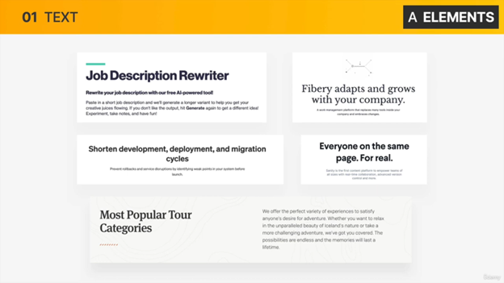
 

- **Button**

 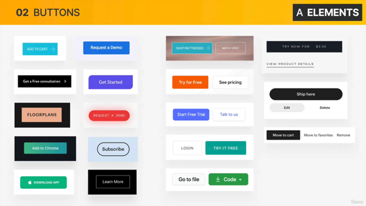

- **Images**
 

- **input elements**
 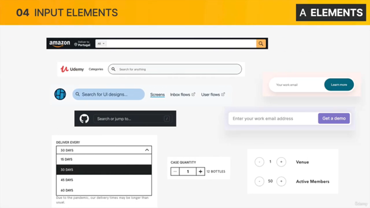
  
- **tags**
 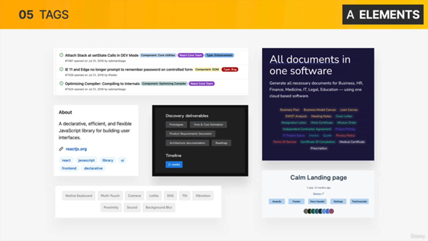

## Component (20 Item)*

- Breadcrumbs
 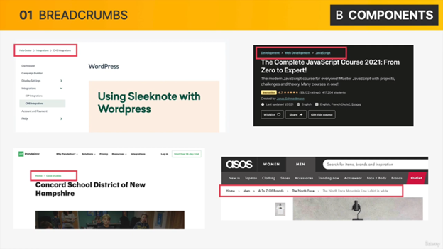
  
- Pagination

 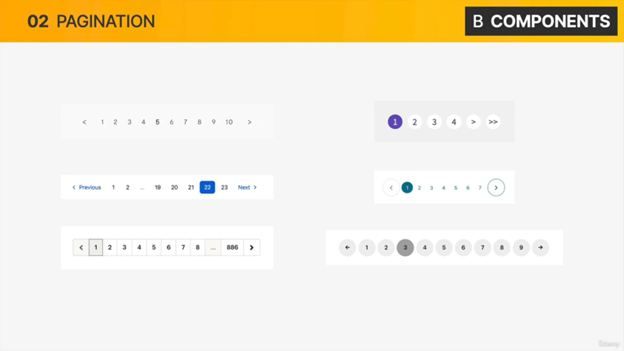

- Alert and status bar
 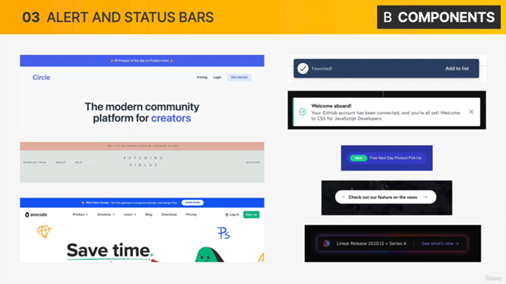

- statistics

 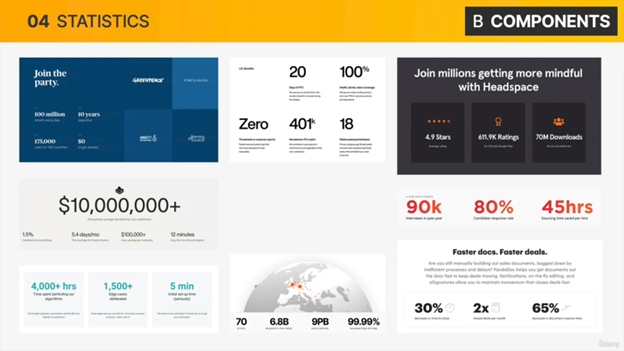

- gallary

 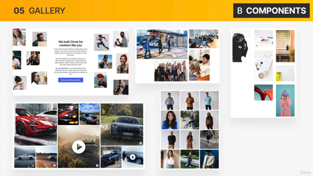
 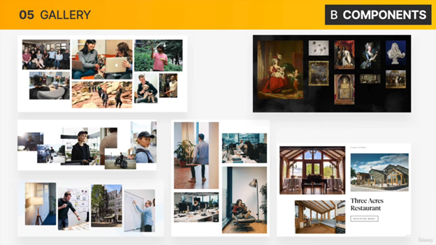

- Feature box
  
 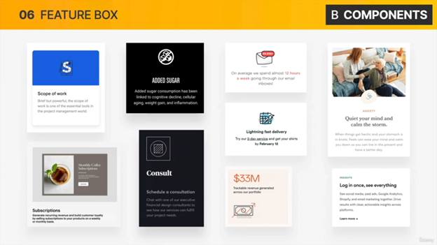
 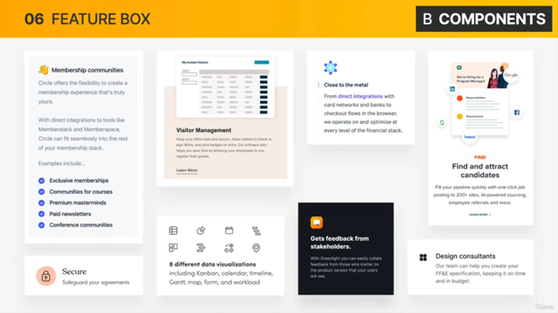

- Previewa and profile Cards

 
 
 

- Accordion
 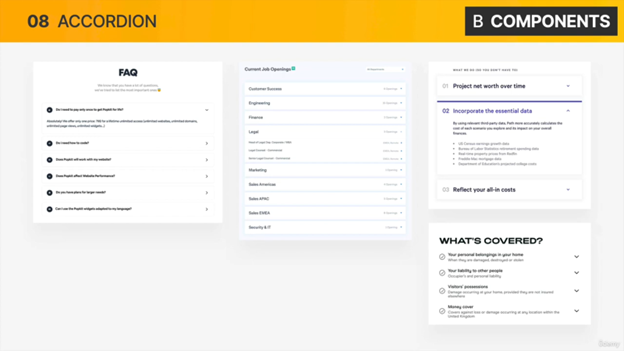
 

- Tabs
 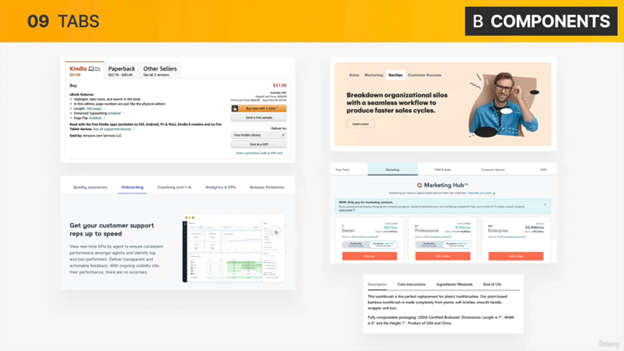
 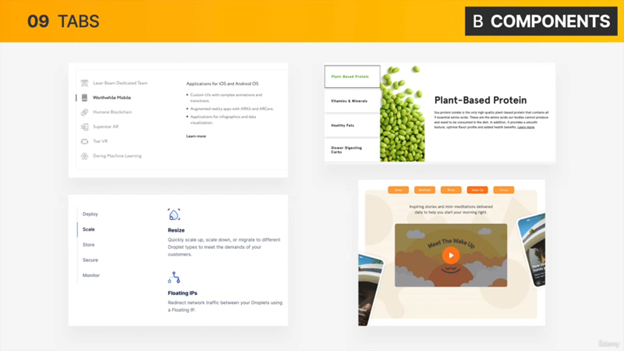
- Carousel
 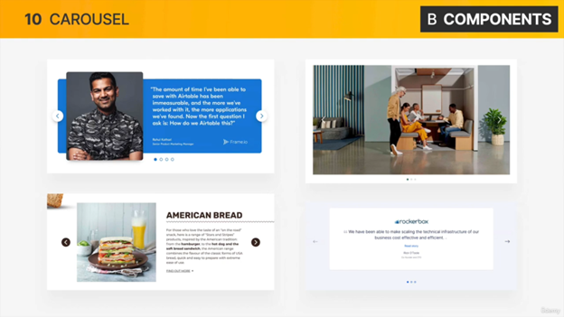
 
  
- Customer Testiminials
 
 
 

- Customer logos
 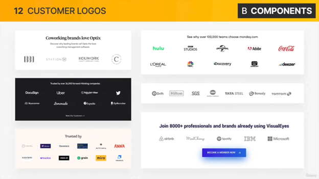
 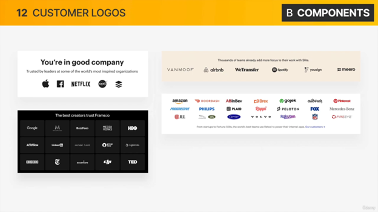
- Featured-in loges
 
- Steps
 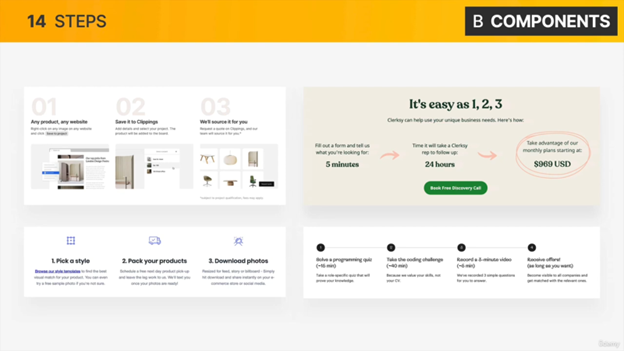

- Froms
 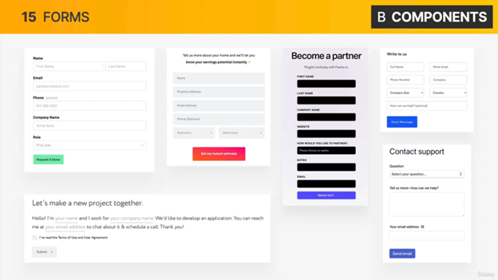
 
 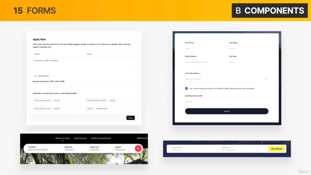
- Tables
 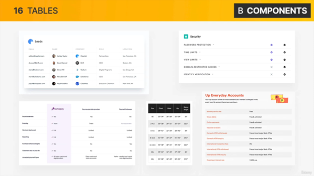
 
- Pricing Tables
 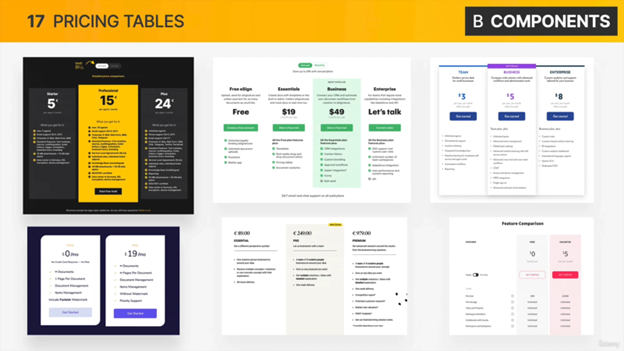
 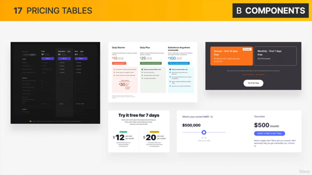
- Model widnows
 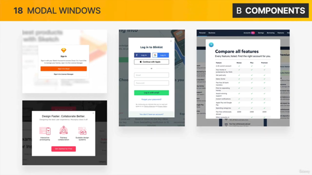
 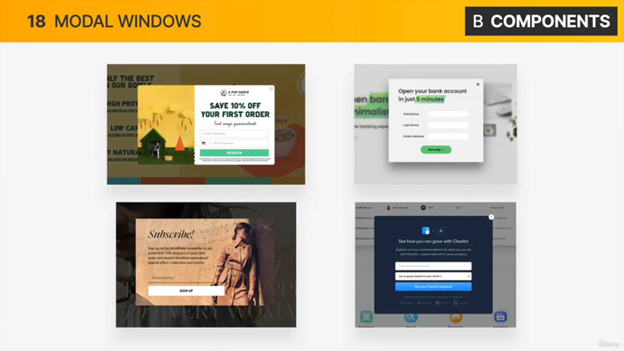
  
## section Component

- Navigation
 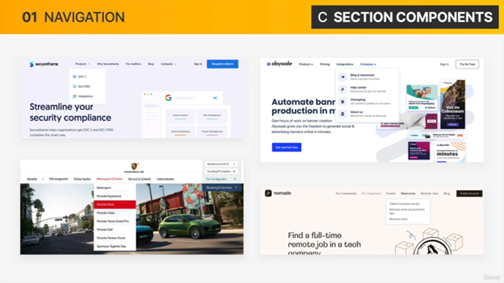
 
 
 
 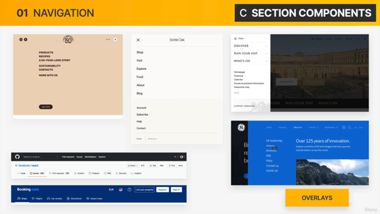
 

- Hero Section
 

 
 
 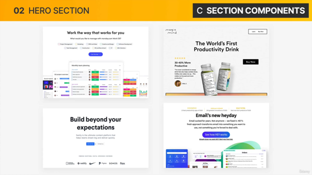
 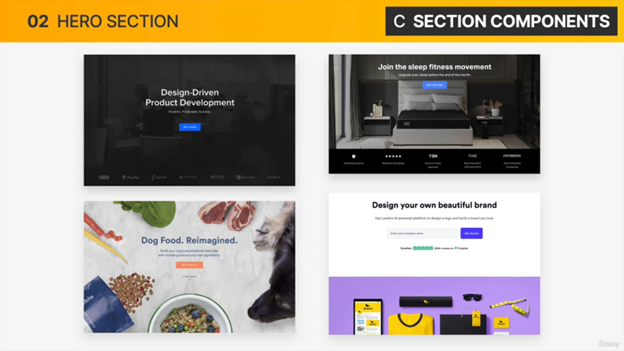

- Footer
 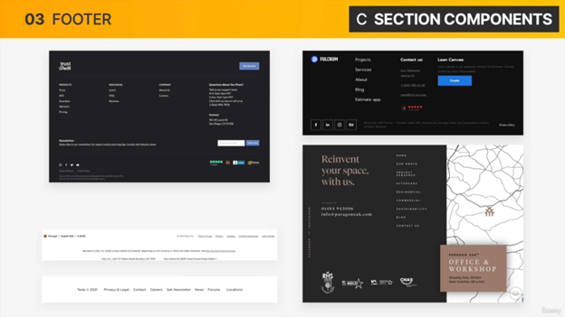
 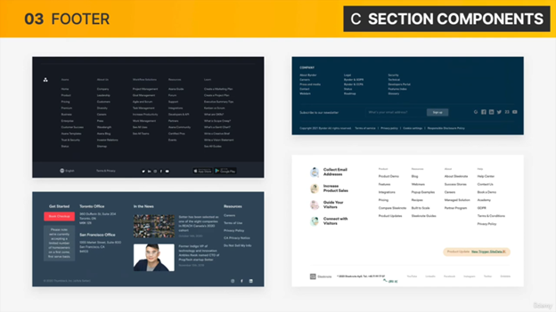
 

- Call-to-action Section
 
 
 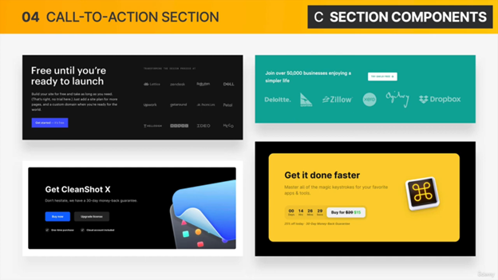
 
- Feature Row
 
 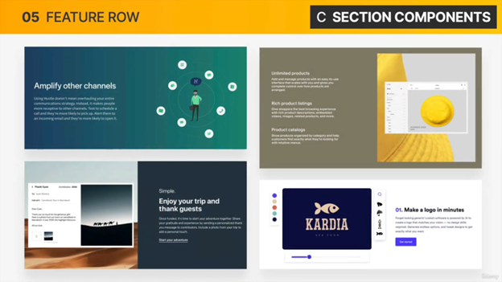
 
 

## Layout pattern

- Row of boxes or cards
 

- Grid of boxes or cards
 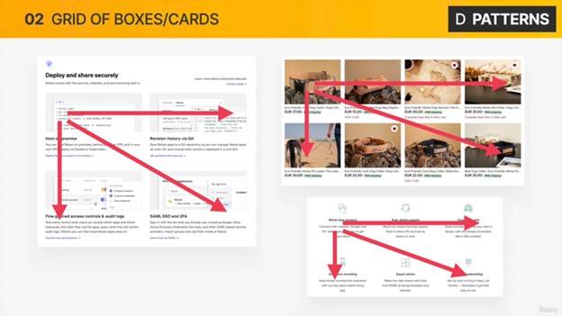
 
 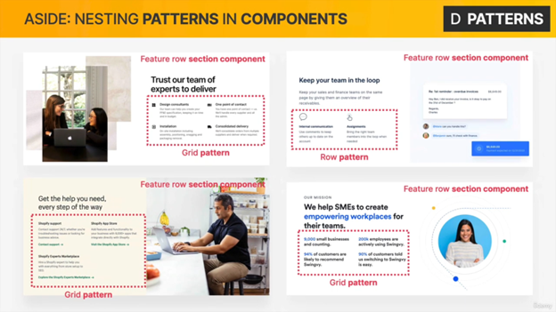

- z Pattern
 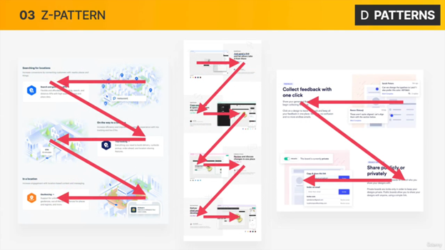
 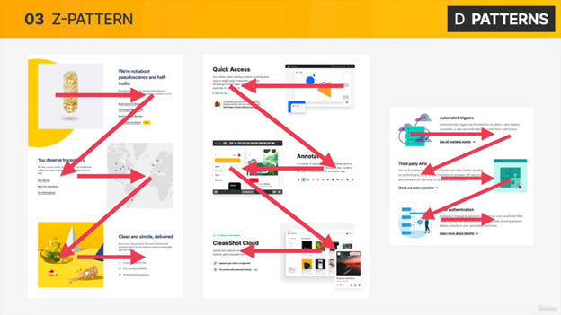
- F pattern
 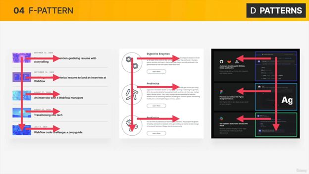
 
- single column
 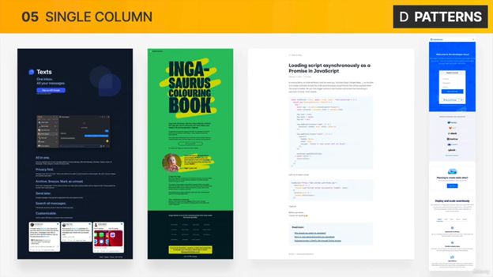
- sidebar
 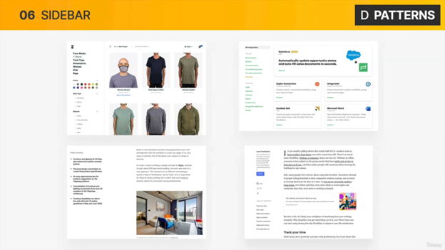
 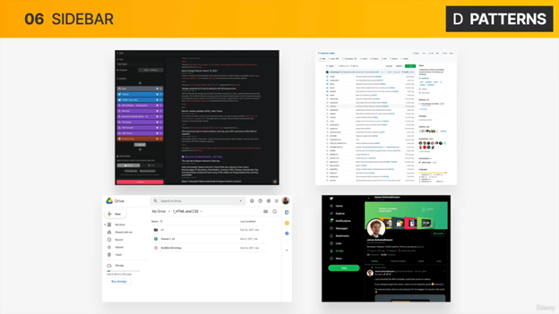

- Multicolumn/Magazine

 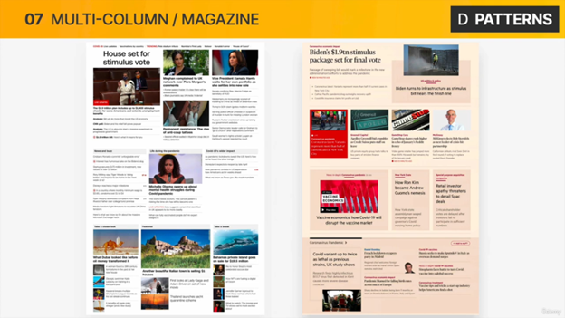

- Asymmerty/Expermental
  
 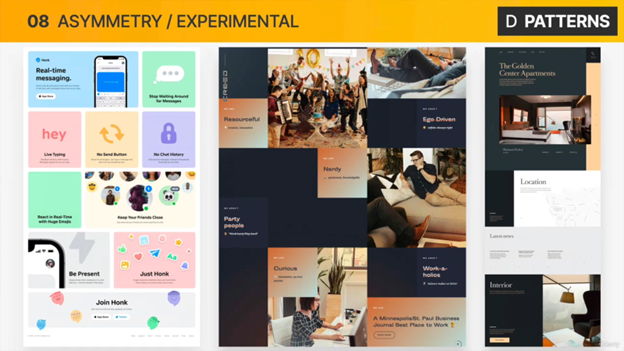
 
