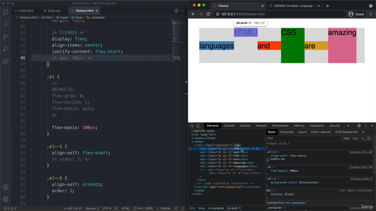
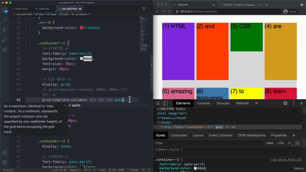
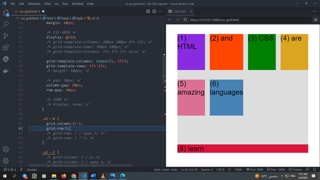

# Html and css Refresh

## section 1

How browser or website is work?


When you browse to certien website and  hit url you make our browser to send requestto go from client side to server where the website store

  $$\color{red}{Server}$$
Server is acpu connected to the internet  and able to recieve request like that one  this serevr host many website or perserve many website

$\color{white} \colorbox{Green}
 { Note : }$ server also mean or called Api

When server recieve request it take all file that make website and send back to browser that send we call this a response its send  3 core language Html and css and js

## 1 - diffrent between  static and dynamic web page

Static website mean that   the file  that make website simply stored in server  and send to the browser  as they are without  make any transfomation


____________________________________
**************************************/
Dynamic web page => which web server connected with Data base and create anew version of HTML


____________________________________
**************************************/
 So if you visit the dynamic websit the new Data is  make or generate anew version  of website each time you visit website and send it  you browser

 while static website
 the file of website stay in the browser in same version no new version is created and wait some one access to it


$\color{white} \colorbox{red}
 { img : }$  its empty tag   dosent have child node

## section 2

 3] how element display  on web page
  display by using box shadow


- Fill area it when you  apply background on box  model

this is actual final element width and height


so we change the final width by choose border-box we dont include margin

**_____________________________________**.

**$\color{blue}{border-box}$**
  
- The width and height properties include the content, padding, and border, but do not include the margin. Note that padding and border will be inside of the box. For example, .box {width: 350px; border: 10px solid black;} renders a box that is 350px wide, with the area for content being 330px wide

Here the dimensions of the element are calculated as: width = border + padding + width of the content, and height = border + padding + height of the content

**_____________________________________**.

**$\color{blue}{content-box}$**

- This is the initial and default value as specified by the CSS standard. The width and height properties include the content, but does not include the padding, border, or margin. For example, .box {width: 350px; border: 10px solid black;} renders a box that is 370px wide.

Here, the dimensions of the element are calculated as: width = width of the content, and height = height of the content. (Borders and padding are not included in the calculation

**_____________________________________**.

- 5) what is diffrent between block element and inline and inline block


- this is block element
  1- box model=>  width and height Applied shown
  2- line break
  3- 100% width


- this inline Element
  1- box model=> cant control on width and height
  2- no line break
  3- occupies Only content`s space
  4-  padding and margin applied horizontal


- Inline-blocks beave like inline box from outside and blocks from inside

 Its excpect to work like block level element  I can apply margin   But out side its look like inline element its stay side by side

- **Note** :notebook:
   Img is inline element  but it behave like inline block element ican apply width
<!-- ********************************** -->
   Pseudo element its element don’t exist in html and can be selected and styled in

- Any pseudo element it’s a inline element

we should write  inline block at least
``
display :inline-block
``
<!-- ********************************** -->

- Text align you use it for parent  to center child

<div \` dir="rtl">

 هنا ال inline block  لازم تضاف الي  child not parent  اما  flex  دي    لل parent
</div>

<!-- ********************************** -->
Adjacent sibbling it  sibbling coming right after it example:

> h3+ p{
> color:red;
> }

$$\color{red}{next- P -will- become- red}$$

- to define bugs
  


<!-- -https://www.linkedin.com/posts/ali-samir-ali_html-css-javascript-activity-7007703262636191745-JGVG/?utm_source=share&utm_medium=member_desktop -->

## section 3

- what is css rule ?


- 8 PROPERTY TO STYLE TEXT IN CSS
  
  -font-size
  -color
  -font-family
  -text-transform
  -font-style
  -font-weight
  -text-align
  -line-height

### WHAT IS THE DIFFERENCE BETWEEN SERIF AND SANS-SERIF FONTS?

When creating your own text, one of the first decisions to be made is whether to select a font that is Serif or Sans Serif.

- But what are they, and how do they differ, exactly?
  - In a nutshell, it’s all about the small features on the ends of strokes in some fonts. Those fonts that have them are called “Serifs” or “Serif fonts.”  Those that don’t are called “Sans-Serifs” or “San-Serif Fonts.” Here’s an image showing the difference between Serif and Sans Serif fonts:


#### links::pseudoclass


##### Theroy 1 in css


Element selector have priority than universal selector
Universal applied on all element and no inheritance involve
And thing I but in body its inherted

##### Theroy 2 in css (inheritance)


<div \` dir="rtl">

User agent style sheet  من الاخر دي  قيمه افتراضيه لل  css  يعني القيمه دي هتلقيها مكتوبه من  css  ذات نفسوا

 هنا بقي هو بيقلي ان  em and strong  بيورثوا  font  من paragraph
</div>

- Border property and form and input  is not inherted

###### Final Solution

- **inline** The element doesn’t start on a new line and only occupy just the width it requires. You can’t set the width or height.
- **inline-block** It’s formatted just like the inline element, where it doesn’t start on a new line. BUT, you can set width and height values.
- **block** The element will start on a new line and occupy the full width available. And you can set width and height values.

### section 4

#### float

dont wast you time on that you wouldnt use it
 we fix the float by usnig **CLEAR FIX HACK**
<div \` dir="rtl">

   يبقي ملخص ال  float
  أولا  ازاي نعمل Margin  between float and flushed pargraph
 ثانيا ازي نخلي  paragraph  لوحدوا جنب ال  float

 ثالثا ازي نحل مشكله  un flow

  المشكله الاولي وهي ال margin
  المشكله الثانيه هي اني اعمل break   لل float  باستخدام ال  clear
ثانيا ازي نخلي  paragraph  لوحدوا جنب ال  float

المشكله د حلها اما  div  فاضي ب  class clear
 او  clear fix
 ثالثا ازي نحل مشكله  un flow
 ده محتاج احطوا في  parent section  ده
يبقي لازم اعمل  display  flow-root
  انا كده خليت ال parent  يمسك ال  float

</div>


- but remember to apply display flow root to the container
  
#### FlexBox

 *Display flex is applied in parent or container
 Un like inline block its applied in child*

- flexbox is align-item: streached by default


<div \` dir="rtl">

  ال  grean element  لما زاد الباقي زاد معاه ولما اقل الباقي اقل معاه اذا element  one flex element effect
 the other
   وطبعا عشان اتخلص من ال  default ده

 </div>

   ```Css
   align-item:center
   ```


- Order =< is very usefull
 Order is zero of all of them
The default is all zero
If you want to move one of them to frist postion you have to take lower number than 0
 Like -1
 If I put order greater than 0 its simple go to end so become the last

 
 
 
 

 we dont use margin  we use gap to  prevent over flow

- in flexbox we dont use width and we always
 use flex basis
- flexbasis and flex-grow and flex-shrink is applied on child
 
 

<div \` dir="rtl">

لما انا خليتهم 200px  بردوا مخدوش 200px  انما خدو 140px
 والسبب في ده هو ان  shrink=1 by default  فده مش بيخليها تاخد ال  contant كامل
 يبقي الحل    تخليها  shrink 0 ده في خاله انك نازي تستخدم  flex basis  بس بردواا هيحصل انا  content  هيبقي  out-flow  طب الحل هو انك تستخدم  flex-grow:1

 </div>

 That’s because flexbox by default requested to  fit the flex item according to its content by flex item by shrinking the item

  I set shrink element to 0
And that contant not fit the container
So it not recommend to set shrink to 0

 

 That what flex grow is doing its fit  container  by flex item

 
 

If I turn of to flex grow is  shrink  and back the contant width
 Flex-grow is divided to all element
 
 
 
 

<div \` dir="rtl">
يبقي ال  flexgrow  انا اقدر استفيد منها عشا انحكم في  flex basis  لما انا اعمل  flexgrow 1  و flexshrink0 الي بيحصل اني انا خليت ال  content  ياخد ال  width كلوا
 كمان لو ال flexbasis  مش موجود انا اقدر اتحكم في العناصؤ عادي بي  grow  اخلي كل العناصر  shrink  واجي   عند واحد فيهم واعمل  grow  زي منا عايز

 </div>

#### grid

 Grid is used for 2 dimintional layout

<div \` dir="rtl">
دي الطريقه الاولي انتا  استخدمت ال  pixel طبعا نتا قلتلو عمودين علي حال لا تسحدم هذا الطريقه ابدا
 في كمان نقطه انا اقدر اثر علي  row عن طريق ان اضيف للعنصر   hight 150 px
  طبعا كلو هيتمدد عشان ال  align-item is streched by default
    او ممكن اعمل ازود  row  ب  templete row

</div>


- grid item is very very very important 💯

we have problem with  column when we use px frist it solid not flexable and over flow container


 so we need to use fr to fill the empty space

 but of course we dont want to use fixed  px
 so we should turn the px with fr
 we can also resize the column


Auto it will take the size it fill to contact
it take there rest space



we use repeat => how many col +fr
and also if we use  row  we should put height


 Auto its take space what it need and leave the rest

#### child Grid

<div \` dir="rtl">
 انا كده خليت عنصر 8 يمشي في  column  الي انا عايزوا
  ان هنا انا برتب العنصر ال  child  في المكان الي انا عايزو   وهو عن طريق حاجتين اما ترتبوا عن طريق ال  col او raw

  نفس ال colum  وده الي اقدر اتحكم في ال  width بتاع العنصر
  ده كده كاني بقولوا هاتلي اخر شي

  هخش علي  row  انا اقدر ارتب العنصر افقيه واحدد طوله كمان
Span  دي ياعني انتا بتحدد انا اخد كام عمود ده كود بيكون افضل بكتير   span  علي طول
انا هسيبك مع 20 صوره  refreash  كل المعلومات عن  grid child
</div>





#### minmax in Grid

<div \` dir="rtl">
     انا هنا بقولوا اني عايز  middle column الي عندي مايقلش خالص علي  300px
</div>
When  the screen git bigger of course  it become 1fr bu if igo less than 300 the midel column dosent shrink  it stay in fix width

It good when I set column layout without media query
He will take on auto fill and quto fit value
 Its help us to set us css grid without media query


#### auto fill and autofit

 Frist  I have 6 column and I put 3  so what if I don’t know how many item I have
What if ineed to set them all in one row


 Here I  use auto fill 200px  so each column have 200px and fill the one row


We also have space here fore particular element column
If we use auto fit instanse of auto fill we will not have this column

It should fit screen if I say 700px

So this is important if we use minmax rather than px


Auto fill we found it will creat more column here


👍👍👍👍👍👍👍👍👍👍👍👍👍👍👍👍👍👍👍👍👍
