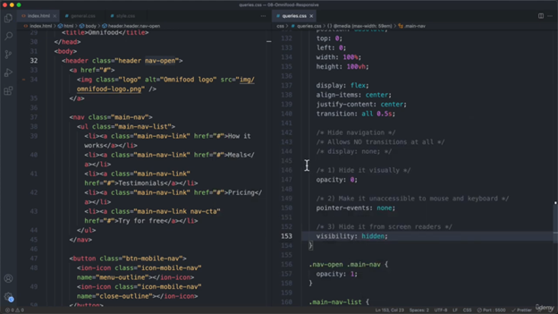
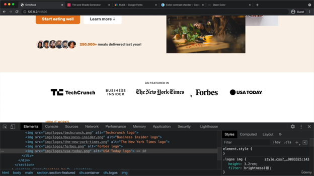
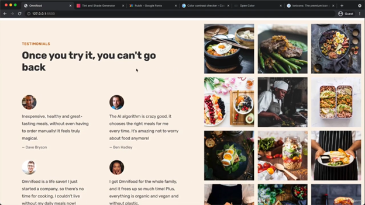
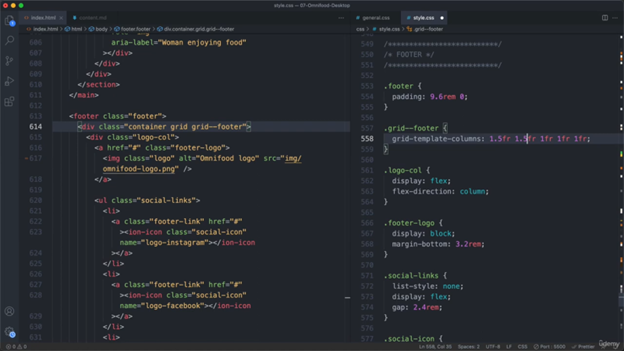

# Rule to start project


 we have many note here:

- frist we always use grid system as much we can

## hero section

- he focus  frist into grid
 then he want to make width 1300px so that will help  the contant in img not stick into edages then he center it by margin auto

- img=> with %

- any header he focus on 6 major thing

  - font-size
  - color
  - font-weight
  - line-height
  - margin-bottom
  - letter-spacing
  
- any paragraph he focus on 3 thing

  - font-size
  - font-weight
  - line-height
  - color
  - margin-bottom


### How to make navigation

- we frist  creat btn on for close and second for menu
- we make this btn Display non in css and display block  in media query max-width 900
- we transfer menu list  we make nav is postion absolute we create anew feature background of nav
- we make ul flex-direction column
- we must hide the nav menu list and  if we ant to make animation we cant go with display none so we will use 3 thing we want to close it
  
``` css
opacity:0;
pointer-events:none;
visibility:hidden;

```

- we make nav open

``` css
opacity:1;
pointer-events:auto;
visibility:visible  ;

```

also nav open when we open   we should have close icon so we select close icon and make it display block and display none in css





## btn create a btn |"| button=> for action

- btn:link&&btn:visted is togather
- btn:hover&&btn:active is togather
- we focus on btn on 8 major thing
  - color
  - background
  - padding
  - display
  - curser
  - transition
  - border radius
  - font-size
  - letter-spacing

**Note :** Dont ever use border in hover its bad thing cuz the screen will pop up and scale so we always use box-Shadow instend

## img

- if you want to make img more  rounded by border radius we use width and height  together with same value
so thats because some browser will complain if you dont provide both likes safari


**Note and very Important:**

- Dont forget you always  color contrast checker between  text and bg
  
 you may also break rules
if we have larg text and bold


## header

- frist
  
```Html
<header>
  <logo>
    <nav>
      <header>
        
        ```

```Css
  Header : flex
  js /al-item
  background
   this is most importatant thing when we put headerCss
   we make  fixed height 
   so it 9.6rem
   height :9.6rem
  

```

 
 

- we have bad problem
it comming from padding

 
 

### create Navigation

 

- He love that hero section more wider than other section

1300 for hero secion and  1200 for rest of hero

## codes to make  some thing gray

 
 
 
 

**Note** => every time we start ne section

```Css
.newSection{
  
  padding: 9.6rem 0;

}

```

## card

  
  
  

  

  
  
  
  

img = width 100%

## testimoial

 we can set grid here as that

```Css
grid-templete-column: 55fr 45fr
```

  
  
  
  
  

- look at text and saw the setup

## price Card

We make this column less wider we use width 75% and  justify self

We want the user to select this on write
Its visual hirchey
So we should de emphsize this one on left
 This is one here we well create to improve hirchey


## cta

 very important of you make back ground img you should set attribute like role in html

```Html
role="img"

aria-label="Women  enjoying Food"

```

**Form need to inherit font family**
**Color inherit it mean its automatically inheret from parent**

outline focus problem

we fixed by **box-shadow**


![ how browser work!](../img/../../img/

## Footer

we use grid 1.5fr 1.5fr 1fr 1fr 1fr




