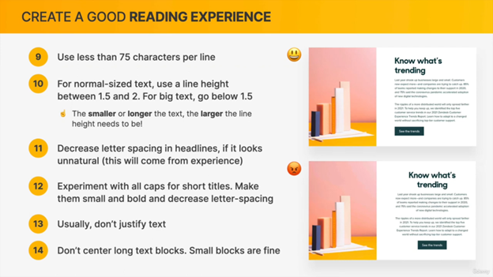
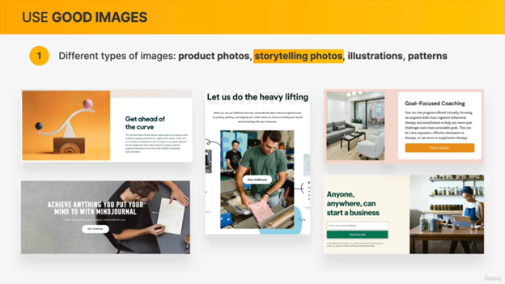
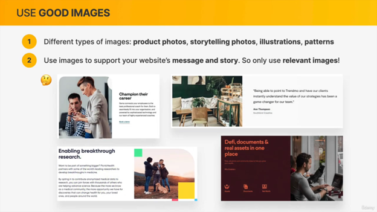
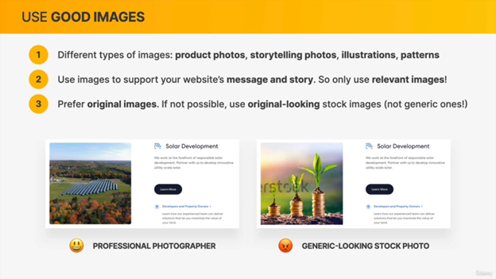
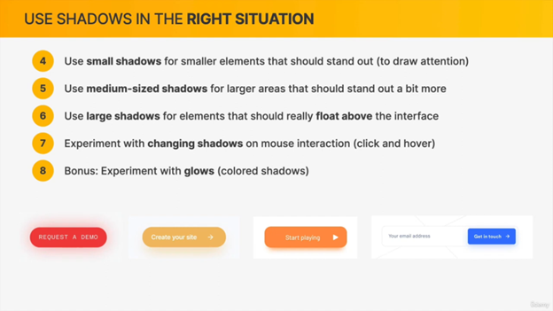
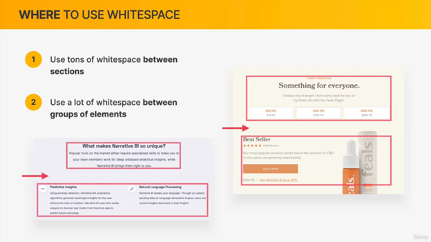
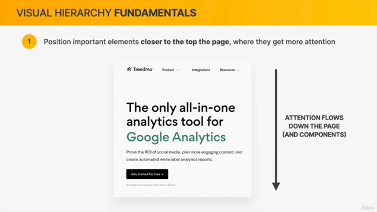
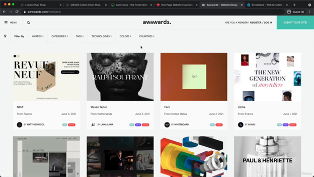

# Web Design

## Web Design ingredient its 10items

### typography

### colors

### img

### icons

### Shadows

### Border radius

### White space

### visual hierarchy

### user Experiense

### component and layout

///////////////////////////////////////////

#### Web perosonality

دي هي اشكال المواقع الي انتا هتشتغل عليها وهتطبق عليها  يعني كل موقع ليه ال  gradient  الخاص بيه  وكل موقع بيطبق عليه مكونات مختلفه   من 10 مكونات  من  ال مكتبوين فوق  كل موقع  فيه  color  خاص بيه وخط خاص بيه وهكذا
هما 7 اشكال انتا بتحدد  واحد قيهم او بتعمل  mix  بينه وبين واحد تاني

- serious/Elegant

  
- Minimlist/Simple

  
- Plain/Netural

  
- Bold/confident

  
- calm/peacefull

  
- startup/Upbeat

  
- playfull/fun

### typographys

  انا هنا هنتكلم علي نوعين من الخطوط serif and sansSeirf وهنعرف ايه الفرق الي بينهم كمان وده مهم جدا ايه  الخطوط الي انا  بتعامل معها سواء في sierf  او sans

- serious/Elegant

  في بعض القواعد في ال  font باذات وهي اولا  اختار المالوف يعني جميع المواقع ماشيه علي خطوط معينه المشاهد دمن شكل هذا الخط فهيتعامل معاه باريحيه في القرائه علي العكس انك لو جبت خط جديد  دي مش هيريح عنيه
ثانيا مفيش مشاكل انك تستخدم كذا نوع من الخطوط لكل صفحه بس اخرك بس توعين مختلفين من الخط في الصفحه الواحده
علي حسب ال  website  الي انتا هتعملوا اختار الشكل المناسب
للخط علي حسب الصفحه
 رابعا اختار scale  في ال fontsize  متبقاش عشوائي في اختيارتك
خامسا يكون ال  font size مابين 16 الي 32 px
وده في  normal text  اما الlarge text هتستخدم 20 tdlht,r

- font-weight<400 should be avoided

- headline >50px and 600 bold
- Line height between 1.5 and 2 for big text should go below 1.2

#### this is font framwork should be Used =>

      /*
      
      FONT SIZE SYSTEM (px)
      10 / 12 / 14 / 16 / 18 / 20 / 24 / 30 / 36 / 44 / 52 / 62 / 74 / 86 / 98
      */

- make sure that tect doesnt break line
- string and em will inherite font size
  
## color

this color we look at the state of web site carefully before we start creating a  website  

[Go to Open-Color](https://yeun.github.io/open-color/)

[Go to tailwind css-color](https://tailwindcss.com/docs/customizing-colors)
[Go to Flat ui-color](https://flatuicolors.com/)
this is color we pick one of them and it give me a 9 gradient of color  pick

we need jsut 2 color  main and grey for text so we may use some one in between according to contrast of page and that is called **Accent**

### Accent color

 You  need simulation between  **green** and  **grey**color

So you need some tools to check best accent color

We need  *darker* and *lighter* for **every 3 color**

Darker called **shads** and lighter is **tints**

if we want to select shade and tint generator we use this

[Go to tint and shade generator](https://maketintsandshades.com/#eeaaee/)
[Go to Coolors](https://coolors.co/2f2504-594e36-7e846b-a5ae9e-d0ddd7)
[Go to paleton](http://paletton.com/#uid=1100u0kllllaFw0g0qFqFg0w0aF)
[Go to ui-Gradient](https://uigradients.com/#MoonlitAsteroid)

- very important we always check contrast ratio between background and color of text
  
[Go to check color contrast](https://coolors.co/contrast-checker/112a46-acc8e5)

## images

the img should be related to website
dont put any photo or img
crop img
compress all img and make it double orginal size
[Go to compress-img-squoosh](https://squoosh.app/)

## icon

We can not scale this icon with bitmap
Feature block help the user to identify what is section taking about
Simply those icon  explain it self you don’t need text    to  explain what is option does
 Don’t choose the thick line icon
 The solutioon is to keep you icon with line like this  small
Thin line is the best solution

backgroundcolor=> stroke and fill is color

## shadows

Box shadow 4/5value taken

- Horizontal offset  mean lentgh horizontal  between box and shadow
  
- Vertical offset  
- Blur
If we use small value it almost not blurred
  If we use large shadow so the blur is very huge
Scale shadow up and this optional
 Last one is color  he choose black

 

 
 
 
 
 
 
 
 
 
 
 
 
 
 
 

## Border-radius

- Senetive is 12px
- dont forget we have btn:link and btn:visit
 
 
 
 
 
 
 
 

### White-space

- Whit space is invisible and it’s the best way to fix problem in desgin
Whit space is space between element
- Between section we need white space
  we have rule to White space also

SPACING SYSTEM (px)
      2 / 4 / 8 / 12 / 16 / 24 / 32 / 48 / 64 / 80 / 96 / 128

 
 
 
 
 
 
 
 
 
 
 
 
 

### visual-hierarchy

 The visual hierkey is completely loss because we  the page has no color

- font-size and font-weight and color is the best way to emphsize element or deEmphisize element

- Its   emphasize and important text and e de-emphasize  the less  importanant

 
 
 
 
 
 
 
 
 
 
 
 
 
 
 
 
 
 
 
 
 

### user-Experiense
  
- So the best advice to go to website that user familer webDesign instated you  make orginnal  use  same patterns that user know
  
- You shoiuld make 100% you website is clear and relevent
 Don’t   provide a fluff content that no contain a relvent information

**what is fluff in writing?**

- We define fluff writing as any part of a piece that is off-topic, adds unnecessarily to the word count, makes the piece harder to understand, or bores readers.
  
 **Coneyy =>**  meaning to express feeling

-A voide  technical **jargon** this thing you know but user don’t know it *But that is confuse user*

- Break up you long text with sub heading or images

 
 
 
 
 
 
 
 
 
 
 
 
 
 

### websitepersonality

- **What is website personality?**
 It you feelling that you have and you want to express this feellin and convey to user

And also you want  to ivoke user with this feelling
So after you answer this question you have to choose one or 2 personalites

- **Why personality is actually so imprtant ?**

 Cuz it well make you webdesgin easier for you
 Once you have personality selected  you design for each desin ingredent  become really limited

 So frist personalites like  serious doesent use shadow and  also border raduis

While the start up use this all time

 
 
 
 
 
 
 
 
 
 
 
 
 
 
 
 
 
 
 
 

- **Steal like an artist**

 
 
 
 
 
 
 
